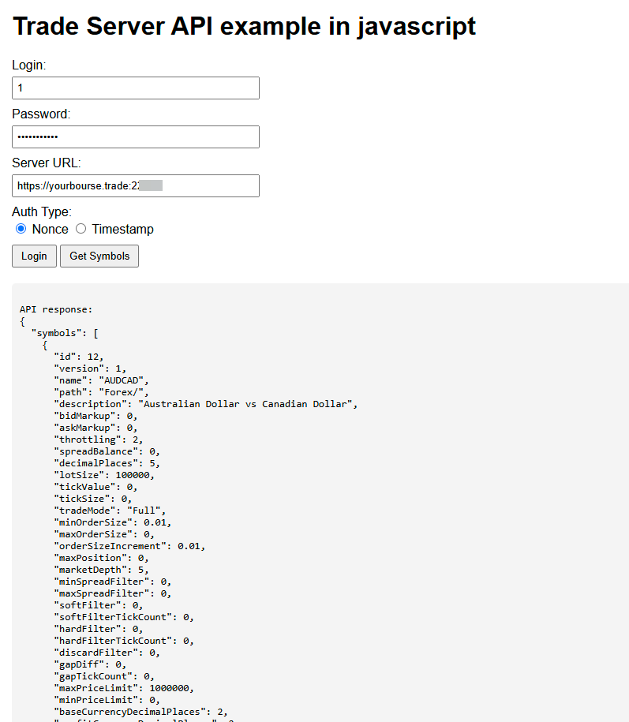
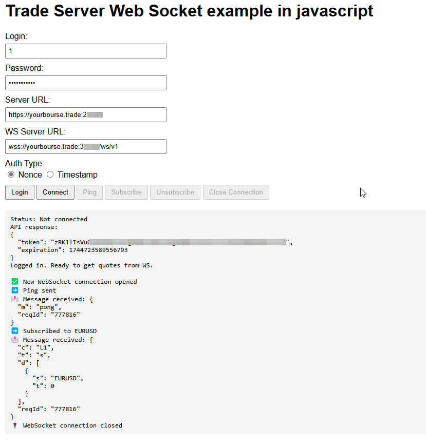

# Trade Server API and WebSocket Examples

This project demonstrates how to interact with a trade server using both REST API and WebSocket protocols. The examples are implemented in JavaScript and include HTML files for testing the functionality in a browser.

## Project Structure

    ├── apiExample.html         # Example for interacting with the REST API 
    ├── webSocketExample.html   # Example for interacting with the WebSocket API 
    ├── javascript.js           # Core JavaScript functions for API and WebSocket communication 
    ├── styles.css              # Styling for the HTML pages 
    ├── Readme.md               # Project documentation

## Prerequisites

- Access to a trade server with valid credentials (login, password, and Trade Server Admin API).
- Note that Trade Server API port starts with 2, Web Socket port starts with 3.

## Usage

### REST API Example

The `apiExample.html` file demonstrates how to authenticate and fetch symbols using the REST API.

1. Open `apiExample.html` in your browser.
2. Fill in the following fields:
   - **Login**: Your login ID.
   - **Password**: Your password.
   - **Trade Server Admin API**: The URL of the trade server.
3. Select the authentication type (`Nonce` or `Timestamp`).
4. Click **Login** to authenticate.
5. Once logged in, click **Get Symbols** to fetch the list of symbols.

Screenshot:

### WebSocket API Example

The `webSocketExample.html` file demonstrates how to connect to the WebSocket API, send requests, and handle responses.

1. Open `webSocketExample.html` in your browser.
2. Fill in the following fields:
   - **Login**: Your login ID.
   - **Password**: Your password.
   - **Trade Server Admin API**: The URL of the trade server.
   - **Tarde Server Public WebSocket URL**: The tarde server public WebSocket URL.
3. Select the authentication type (`Nonce` or `Timestamp`).
4. Click **Login** to authenticate.
5. Click **Connect** to establish a WebSocket connection.
6. Use the following buttons to interact with the WebSocket:
   - **Ping**: Send a ping request.
   - **Subscribe**: Subscribe to a symbol (e.g., `EURUSD`).
   - **Unsubscribe**: Unsubscribe from a symbol.
   - **Close Connection**: Close the WebSocket connection.

Screenshot:

## Core JavaScript Functions

The `javascript.js` file contains reusable functions for API and WebSocket communication:

- **HMAC Digest Generation**: `getHMACDigest(secret, body)` generates an HMAC signature using the `crypto.subtle` API.
- **Base64 URL Encoding**: `toBase64Url(str)` converts a Base64 string to a URL-safe format.
- **Header Generation**:
  - `getPOSTHeaders(user, data, authenticationMethod)` generates headers for POST requests.
  - `getGETHeaders(user)` generates headers for GET requests.
- **Fetch Data**: `fetchData({ url, method, headers, data })` sends HTTP requests and handles responses.

## Styling

The `styles.css` file provides basic styling for the HTML pages, ensuring a clean and user-friendly interface.

## Notes

- Ensure that the server URLs and credentials are correct before testing.
- The examples may require adjustments.
