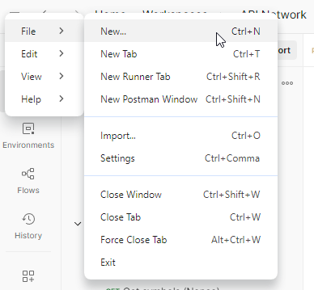
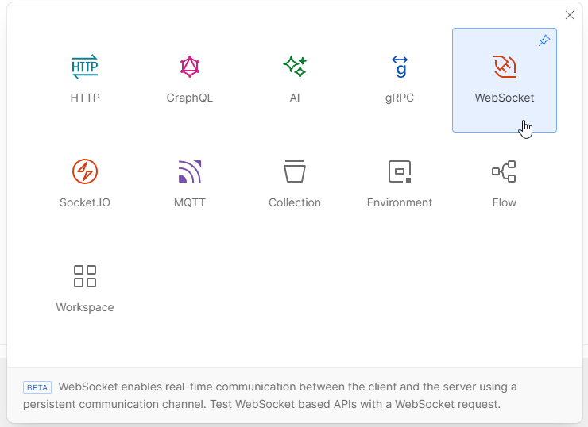
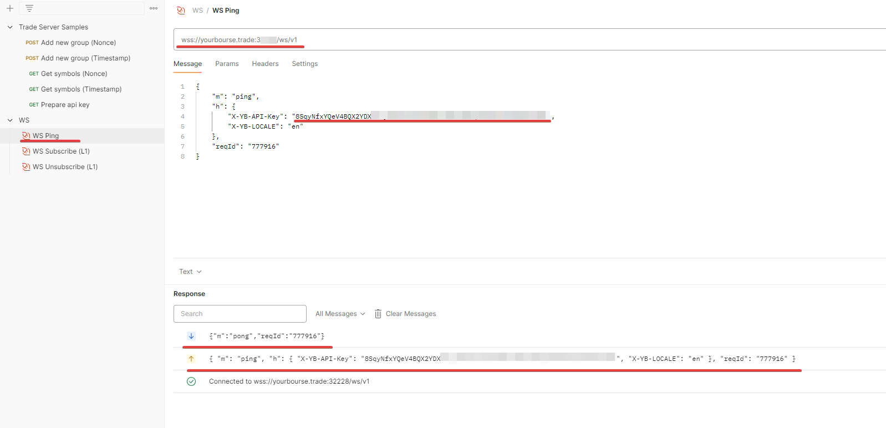
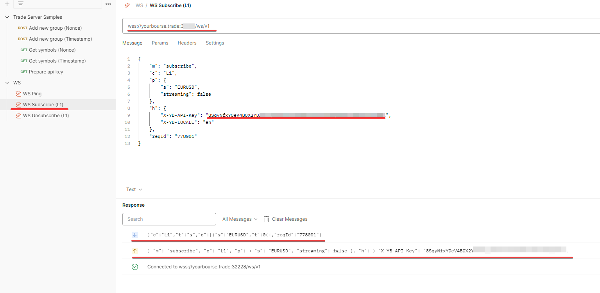
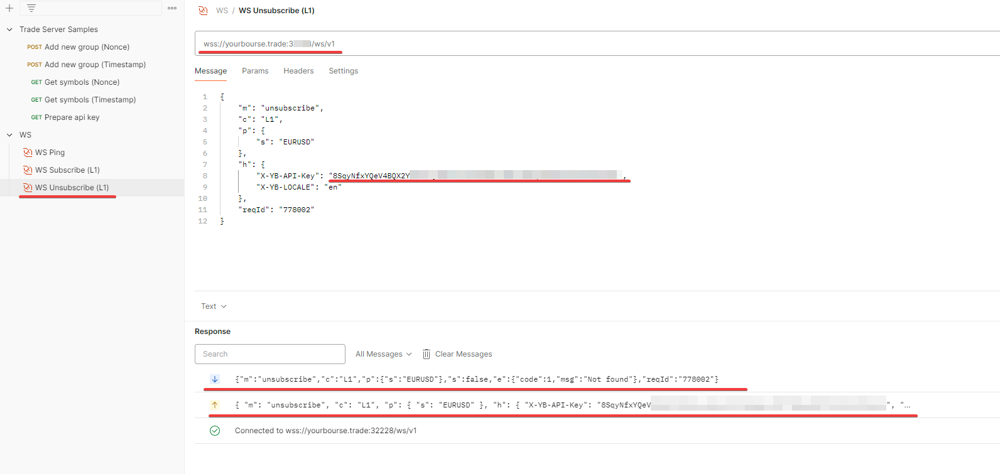
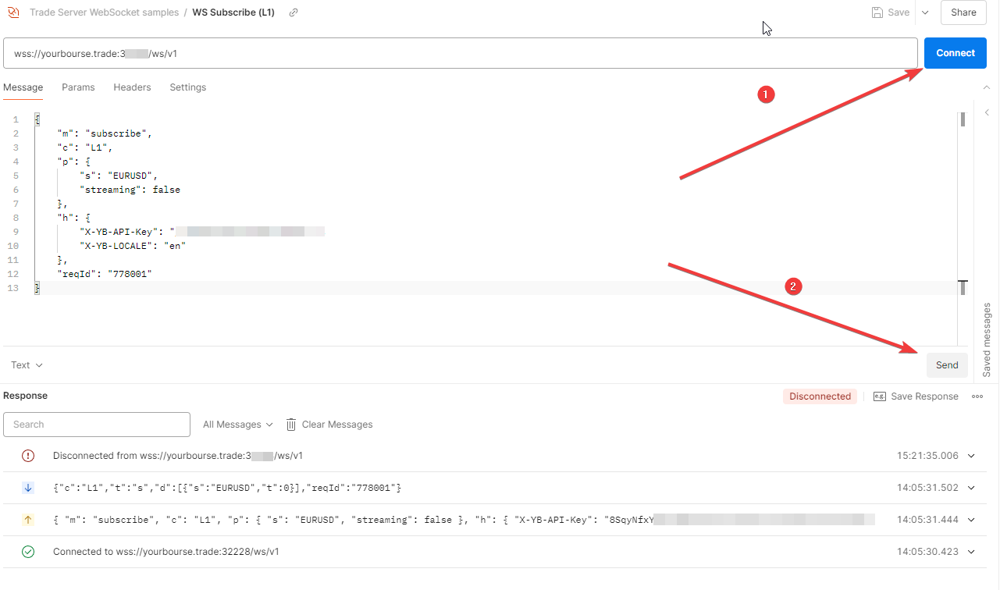

# Postman Collections for Trade Server

This directory contains Postman collections and environment files to help you test and interact with the Trade Server API.

## Directory Structure

- **Collections**: JSON files located in `/postman/*.postman_collection.json` that define API requests.
- **Environments**: JSON files located in `/postman/*.postman_environment.json` that store environment-specific variables.

## How to Use

1. **Install Postman**: Download and install [Postman](https://www.postman.com/downloads/).
2. **Import Files**:
   - Import collections from `/postman/*.postman_collection.json`.
   - Import environment files from `/postman/*.postman_environment.json`.
3. **Set Up Authentication**:
   - Choose between **Nonce-based auth** or **Timestamp-based auth** examples.
   - Configure `login`, `password` and `baseUrl` in the imported environment.


## Authentication

You can use either:
- **Nonce-based auth** examples or
- **Timestamp-based auth** examples

Set your `login`, `password` and `baseUrl` in the selected environment.

## Sample Collection Includes

- Authoriation to get the token/apiKey
- Add a new group (nonce/timestamp)
- Get symbols (nonce/timestamp)


## Scripts

There are many pre-request-scripts defined in the examples. Please use them as it simplifies getting the token/apiKey which is later use in POST requests.

## Web Socket examples:

Unfortunettly, there is no way to export/import Web Socket examples in Postman so here are the steps to setup WS samples:

1. Go to File -> New...

   

2. Choose Web Socket

   

3. WebSocket Ping example

   

   Use this WS address:
   ```
   wss://yourbourse.trade:3xxxx/ws/v1
   ```
   The websocket port number starts from 3

   Payload:
   ```json
   {
    "m": "ping",
    "h": {
        "X-YB-API-Key": "__place_auth_token_here__",
        "X-YB-LOCALE": "en"
    },
    "reqId": "777916"
   }
   ```

4. WebSocket Subscribe (L1) example

   

   Use this WS address:
   ```
   wss://yourbourse.trade:3xxxx/ws/v1
   ```
   The websocket port number starts from 3

   Payload:
   ```json
   {
    "m": "subscribe",
    "c": "L1",
    "p": {
        "s": "EURUSD",
        "streaming": false
    },
    "h": {
        "X-YB-API-Key": "__place_auth_token_here__",
        "X-YB-LOCALE": "en"
    },
    "reqId": "778001"
   }
   ```

5. WebSocket Unsubscribe (L1) example

   

   Use this WS address:
   ```
   wss://yourbourse.trade:3xxxx/ws/v1
   ```
   The websocket port number starts from 3

   Payload:
   ```json
   {
    "m": "unsubscribe",
    "c": "L1",
    "p": {
        "s": "EURUSD"
    },
    "h": {
        "X-YB-API-Key": "__place_auth_token_here__",
        "X-YB-LOCALE": "en"
    },
    "reqId": "778002"
   }
   ```

   Replace ```__place_auth_token_here__``` with the token/apiKey which we can get from standard API Authorize request.


In general, we need to Connect first and then Send the payload like here:

